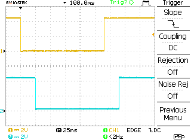
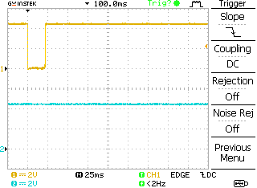
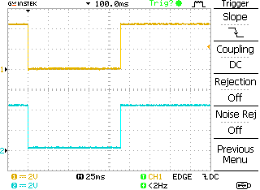
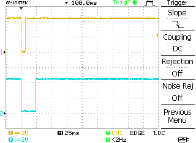
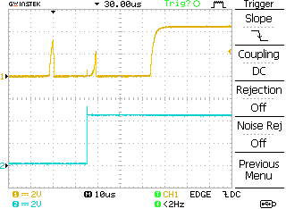
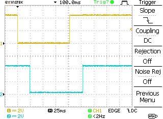
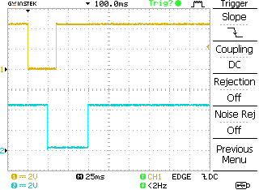

Documentation
=============


Debounce Duration
-----------------
```c++
// debounce setup
DBounce<uint8_t, __DBNC_N(buttons), 25, 0> debounce(buttons);

// debounceMS = 25  //ms
// lockoutMS = 0    // zero results in no lock-out
```

The behaviour with debounce duration only is a delay of both edges by *debounceMS*. During this time the logic level has to be stable.

- Channel 1: input signal
- Channel 2: debounced input signal



Glitches which are shorter than *debounceMS* are not recoginzed.




Lock-out Duration
-----------------
```c++
// lock-out setup
DBounce<uint8_t, __DBNC_N(buttons), 0, 25> debounce(buttons);

// debounceMS = 0  // 0 means: no debounce
// lockoutMS = 25  // ms
```

The behaviour with lock-only duration only looks rather transparent.




Short glitches are recoginzed but the resulting signal has a duration of at least *lockoutMS*.




First deteced change counts. There is some processing delay which depends on CPU speed and number of handled inputs.




Combined debounce and lock-out
-----------------------------
```c++
// combined setup
DBounce<uint8_t, __DBNC_N(buttons), 25, 25> debounce(buttons);

// debounceMS = 25  // ms
// lockoutMS = 25   // ms
```
Get the best out of both world. The combination allows fast reactions without unexpected "button presses" from distortion which can occure with lock-out only setups. Normally the debounce signal looks like a debounce-only signal...



... but short signals are prolonged to a least *debounceMS* + *lockoutMS*.




**Experience:**
An explicit real button press needs more than 50ms. That's a real life debounce timeout used in million of electronic devices which were developed by me for crappy wall and small tactile switches. Well, somebody would say that the response time is not good with 50ms but good response needs to be in balance with good robustness (normally against electric distortions).
